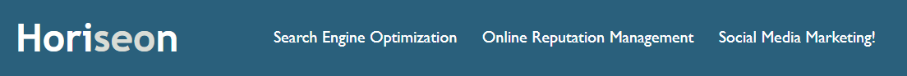

# Improve Accessibility For Website

## Description

Accessible website don't jsut promote usability; they also increases the chances of the business site being found on search engires so that the business brand can be strengthen.
Businesses that integrate accessibility are more likely to be innovative, inclusive enterprises that reach more people with positive brand messaging that meets emerging global legal requirements.

This project is to refactor the code base to follow accessibility standards for a client in order to optimise the accessibility for search engines. The refactor process doesn't change the functionality and the layout of the website but updates the HTML with semantic elements. CSS selectors and properties are also consolidated and organised to follow semantic structure of the website.
 

## Table of Contents

- **[The Breakdown of a Website](#breakdown)**
  - [Header](#breakdown-header)
  - [Main](#breakdown-main)
  - [Footer](#breakdown-footer)
- [Deployment](#deployment)
- [Authors](#authors)
- [License](#license)

 

## The Breakdown of a Website

### Header

The header consists of company name on the left and three navigation links on the right. By clicking on the navigation links, user will be navigated to particular content of the website.

 

### Main

An hero image is located at the top the content to provide a first glimpse of professional meeting in
Horiseon followed by the areas of expertise on the left and benefits of choosing Horiseon on the right.

> Professional Meeting in Horiseon

> Areas of Expertise(left) and Benefits of choosing Horiseon(right)

### Footer

A clean footer with sharp text to show the authour of the webpage and the copy right.

## Deployment

Visit the project website using this [link](https://mingzhao91.github.io/bootcamp-module-1-challenge/).
 

## Authors

- **Mingzhao Zhou** - [Mingzhao91](https://github.com/Mingzhao91)
   

## License

This project is licensed under the MIT License.
